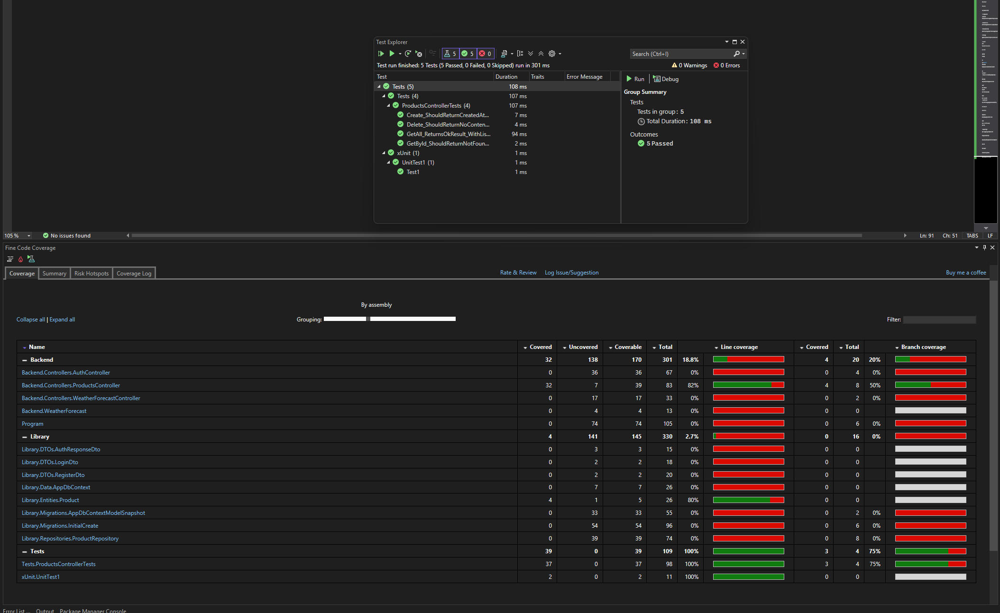

Product Management System API
Proyek ini adalah sistem manajemen inventaris produk berbasis RESTful API yang dibangun dengan standar Senior-Level Development. Fokus utama proyek ini adalah pada kualitas kode, keamanan, skalabilitas, dan pengujian otomatis.

- Tech Stack
Framework: .NET 8 Web API

Language: C#

Database: SQL Server (LocalDB)

ORM: Entity Framework Core

Security: JWT (JSON Web Token) Authentication

Logging: Serilog (File & Console Sink)

Caching: In-Memory Cache

Testing: xUnit, Moq

Coverage: ReportGenerator (Cobertura)

- Fitur & Keunggulan Arsitektur
1. Repository Pattern
Pemisahan logika bisnis dan akses data menggunakan abstraksi Repository untuk mempermudah pemeliharaan dan pengujian kode (Unit Testing).

2. JWT Authentication & Security
Implementasi keamanan menggunakan skema Bearer Token. Setiap endpoint produk diproteksi menggunakan atribut [Authorize], memastikan hanya user yang terverifikasi yang dapat mengakses data.

3. Performance Optimization (Caching)
Implementasi In-Memory Caching pada endpoint GET Products untuk mengurangi beban database pada data yang sering diakses namun jarang berubah.

4. Structured Logging
Menggunakan Serilog untuk mencatat aktivitas aplikasi secara terstruktur ke dalam file log harian (logs/log.txt), mempermudah proses debugging dan monitoring di lingkungan produksi.

- Setup & Instalasi
Prasyarat
Visual Studio 2022 (v17.9+) atau .NET 8 SDK

SQL Server LocalDB

Langkah-langkah
1. Clone Repository
Bash :
git clone https://github.com/riosetiawan97/ProductManagementSystem.git

2. Konfigurasi Database
Buka appsettings.json dan sesuaikan DefaultConnection jika diperlukan:
JSON :
"ConnectionStrings": {
  "DefaultConnection": "Server=(localdb)\\mssqllocaldb;Database=ProductDb;..."
}

3. Database Migration
Jalankan perintah berikut di Package Manager Console atau Terminal:
PowerShell :
dotnet ef database update

4. Run Application
Tekan F5 di Visual Studio atau jalankan:
PowerShell :
dotnet run --project Backend

- Testing & Quality Assurance
Proyek ini memiliki fokus tinggi pada pengujian otomatis untuk meminimalisir bug.
Total Code Coverage: 82.5%
Framework: xUnit & Moq

Menjalankan Unit Test
Untuk menjalankan pengujian dan melihat hasil di terminal:
PowerShell :
dotnet test --collect:"XPlat Code Coverage"

Laporan Coverage

- API Documentation (Swagger)
Aplikasi ini menggunakan Swagger untuk dokumentasi interaktif.
1. Buka /swagger setelah aplikasi berjalan.
2. Gunakan endpoint /api/Auth/login dengan kredensial berikut untuk mendapatkan token:
3. 
Username: admin
Password: password123
4. Klik tombol Authorize di pojok kanan atas.
5. Masukkan token dengan format: Bearer [TOKEN_ANDA].

### Frontend Setup
1. cd frontend
2. npm install
3. npm run dev
